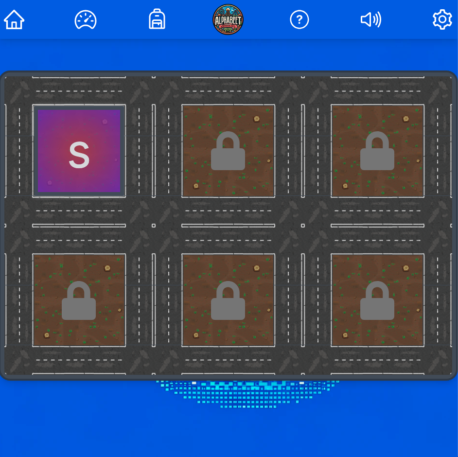
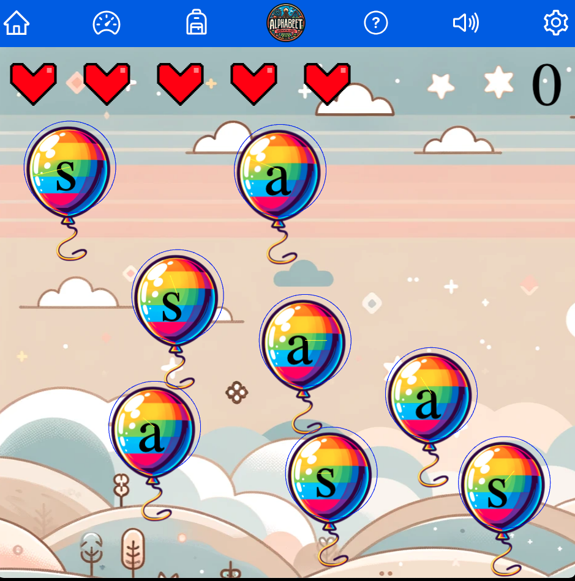

<a name="readme-top"></a>

<!-- PROJECT LOGO -->
<br />
<div align="center">
  <a href="https://github.com/github_username/phonics-ai-game">
    
    
  </a>

<h3 align="center">Phonics Game for Kids</h3>

  <p align="center">
    An interactive phonics learning game for children.
    <br />
    <a href="https://github.com/github_username/phonics-ai-game">View Demo</a>
    ·
    <a href="https://github.com/github_username/phonics-ai-game/issues">Report Bug</a>
    ·
    <a href="https://github.com/github_username/phonics-ai-game/issues">Request Feature</a>
  </p>
</div>

<!-- TABLE OF CONTENTS -->
<details>
  <summary>Table of Contents</summary>
  <ol>
    <li><a href="#about-the-project">About The Project</a></li>
    <li><a href="#built-with">Built With</a></li>
    <li><a href="#getting-started">Getting Started</a></li>
    <li><a href="#usage">Usage</a></li>
    <li><a href="#completion-status">Completion Status</a></li>
    <li><a href="#roadmap">Roadmap</a></li>
    <li><a href="#contributing">Contributing</a></li>
    <li><a href="#license">License</a></li>
    <li><a href="#contact">Contact</a></li>
    <li><a href="#acknowledgments">Acknowledgments</a></li>
  </ol>
</details>

<!-- ABOUT THE PROJECT -->
## About The Project

Phonics Game for Kids is designed to help young children learn and practice phonics through fun and interactive games. Utilizing the power of Next.js for seamless user experiences and Phaser for engaging game mechanics, this project aims to make learning enjoyable and effective for early learners.

### Features

- Interactive gameplay that teaches phonics step-by-step.
- Engaging visuals and sounds to keep children interested.
- Progress tracking to monitor learning outcomes.

<p align="right">(<a href="#readme-top">back to top</a>)</p>

### Built With

- [Next.js](https://nextjs.org/)
- [Phaser](https://phaser.io/)
- [Tailwind CSS](https://tailwindcss.com/)

<!-- GETTING STARTED -->
## Getting Started

To get a local copy up and running follow these simple steps.

<!-- COMPLETION STATUS -->
## Completion Status

### Done
- [x] Project setup and interaction with Phaser
- [x] Demonstration level

### ToDo
- [ ] Add more levels and activities
- [ ] Use of AI for managing difficulty

### Prerequisites

- npm
  ```sh
  npm install npm@latest -g
